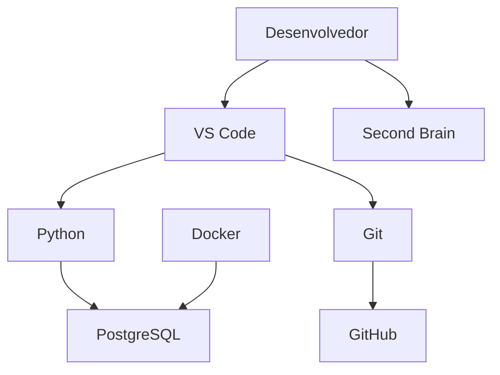

# Data Platform 360 - Arquitetura V1

```mermaid
flowchart TD

    Developer["Desenvolvedor"]

    VSCode["VS Code"]

    Python["Python"]

    Docker["Docker"]

    PostgreSQL["PostgreSQL"]

    Git["Git"]

    GitHub["GitHub"]

    Obsidian["Second Brain"]

    Developer --> VSCode

    VSCode --> Python

    Python --> PostgreSQL

    Docker --> PostgreSQL

    VSCode --> Git

    Git --> GitHub

    Developer --> Obsidian
```